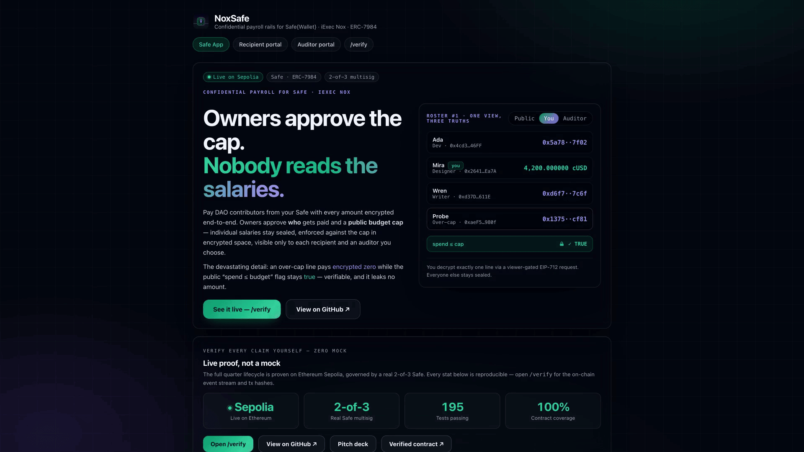
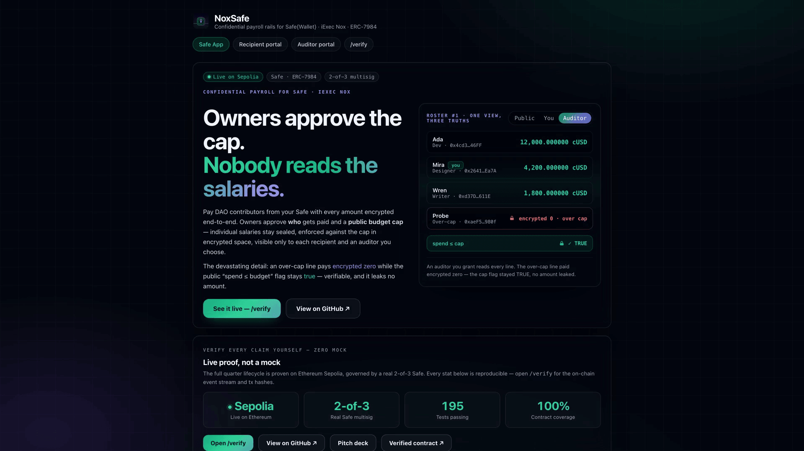
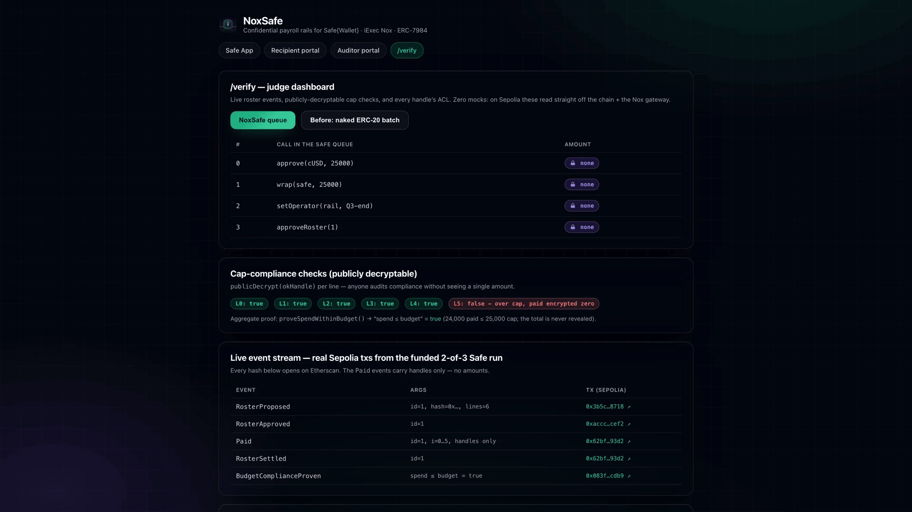

<div align="center">
  
  <h1>NoxSafe 🏦</h1>
  <p><em>Confidential payroll rails for Safe{Wallet} multisigs.</em></p>
  

  <br/>

  [](https://youtu.be/x8KcsXDdJjk)
  [](https://noxsafe.edycu.dev)
  [](https://noxsafe.edycu.dev/pitch)
  [](https://dorahacks.io/hackathon/wtf-hackathon)
  [](https://dorahacks.io/buidl/47257)
  [](https://sepolia.etherscan.io/address/0x3Bd273B4f90829C0fA5d2aFa296b02E2AFaF9642)

  <br/>

  [](https://nextjs.org)
  [](https://www.typescriptlang.org)
  [](https://sepolia.etherscan.io)
  [](https://safe.global)
  [](https://eips.ethereum.org/EIPS/eip-7984)
  [](https://github.com/edycutjong/noxsafe/actions/workflows/ci.yml)
  [](https://github.com/edycutjong/noxsafe/actions/workflows/ci.yml)
  [](https://opensource.org/licenses/MIT)
  [](https://github.com/edycutjong/noxsafe/actions/workflows/ci.yml)

  <br/>

  <p><em>✅ Live on Ethereum Sepolia — a real 2-of-3 Safe runs the full confidential-payroll lifecycle on-chain: sealed amounts, an over-cap line paying encrypted zero, a publicly-auditable cap flag. 195 tests green. Not a mock.</em></p>

</div>

<div align="center">
  
  <p><sub>The live app at <a href="https://noxsafe.edycu.dev">noxsafe.edycu.dev</a> — owners approve a public cap; every salary stays sealed.</sub></p>
</div>

<div align="center">
<table>
<tr>
<td width="50%"><br><sub>Auditor view — every line revealed; the over-cap line pays <b>encrypted 0</b> while the <code>spend ≤ cap</code> flag stays <b>TRUE</b>.</sub></td>
<td width="50%"><br><sub><code>/verify</code> — the full 2-of-3 Safe payroll lifecycle, recomputed from chain.</sub></td>
</tr>
</table>
</div>

---

> **Owners approve the cap. Nobody reads the salaries.**

**The problem.** Safe is the standard for DAO/startup treasuries, but it's radically transparent: every
payout amount is public in the queue *before* execution and on-chain forever after. Contributor comp
becomes a poaching list. Teams either accept the leak or exfiltrate payroll to a custodial processor —
abandoning the multisig guarantees they chose Safe for.

**The approach.** NoxSafe keeps the Safe **exactly as it is** — same contracts, same owners, same signing
queue — and routes only the *amounts* through Nox confidential tokens (ERC-7984). One multisig batch wraps
the payroll float (USDC → cUSD) and grants a **time-bound, revocable ERC-7984 operator** to the
`PayrollRail`. Owners approve **who** gets paid and a **public budget cap**; individual amounts stay
encrypted end-to-end, enforced against the cap *in encrypted space* (`le`+`select`), visible only to each
recipient — and an auditor if the DAO chooses. Delivered as a **Safe App** inside app.safe.global.

**The same roster, three truths:** sealed to the public queue · one line to each recipient · all lines to
the auditor, on one on-chain grant.

## 🔑 Operator, not module (the trust story)

The rail holds **zero Safe execution rights**. It is a time-bound ERC-7984 operator
(`cUSD.setOperator(rail, quarterEnd)`), revocable with one `setOperator(rail, 0)` from the queue. Its
worst-case blast radius is the wrapped float — which the app sets equal to the approved cap (float ≡ cap),
so the worst case *is* the approved spend. The Safe's unwrapped USDC is untouchable. We didn't ask the
Safe to trust a module with its treasury; we asked it to delegate a capped, expiring token authority.

## 🟢 Status — LIVE on Sepolia via a real 2-of-3 Safe ✅

The full quarter lifecycle is proven on Ethereum Sepolia, governed by a **real 2-of-3 Safe** (created via
protocol-kit): the onboarding batch and every approval were routed through the multisig (two owners sign,
the flow executes); the designer decrypted **exactly 4,200** from the live Nox gateway; the over-cap probe
paid **encrypted zero**; the six cap-compliance flags decrypt to **true×5 + false×1**; the auditor decrypted
all six lines (**26,000** proposed, **24,000** actually paid — the over-cap 2,000 line sealed to zero,
so spend stays under the 25,000 cap); and the accounting proof published **"spend ≤ budget = true"**.

| | |
|---|---|
| Demo Safe (2-of-3) | [`0x3Bd273B4f90829C0fA5d2aFa296b02E2AFaF9642`](https://sepolia.etherscan.io/address/0x3Bd273B4f90829C0fA5d2aFa296b02E2AFaF9642) |
| **PayrollRail** | [`0xE7158dAE72C94D6396ed73636d9E5Fe4B5370ED8`](https://sepolia.etherscan.io/address/0xE7158dAE72C94D6396ed73636d9E5Fe4B5370ED8) |
| ConfidentialUSD (cUSD) | [`0x82C281D7403e44d61968c2F49751a56877468991`](https://sepolia.etherscan.io/address/0x82C281D7403e44d61968c2F49751a56877468991) (reused) |
| Onboarding batch tx | [`0x682907a5…f72e1`](https://sepolia.etherscan.io/tx/0x682907a529ea5fae35c2a84c7f74c2abeb14227d84efce0b3ed4f00bdfaf72e1) (one Safe multisig batch) |
| executePayroll tx | [`0x62bf1ca4…b093d2`](https://sepolia.etherscan.io/tx/0x62bf1ca411e87a61100fcf3c33744476ea016d9a2ddea023d8b7612673b093d2) (6 lines, 310,617 gas/payout) |
| Tests | **195 green locally** — 67 Hardhat contract + 128 `@noxsafe/rail-sdk` unit (`npm run test:all`); own contracts (PayrollRail / ConfidentialUSD / DemoUSD) at **100% statements / branches / functions / lines**, enforced by `npm run coverage:check` |
| Bench | concurrent encrypt ×10 = 2.6s (264 ms/line) · decrypt p50 814ms / p95 2.0s · per-payout 310,617 gas |
| Package | `@noxsafe/rail-sdk` (MIT) + `@noxsafe/payroll-kit` CLI |

Reproduce: `npm run e2e:safe` (full multisig lifecycle) · `npm run e2e:local` (zero-gas local mirror) ·
`npm run bench`. Full proof + tx hashes in [`fixtures/e2e-result.json`](fixtures/e2e-result.json).
Etherscan source-verify is one zero-gas command — `npm run verify:contracts` (`ETHERSCAN_API_KEY` is set in
`.env`); DemoUSD + cUSD are already verified.

## 🚀 Quickstart

```bash
npm install
npm run compile
npm run test:all  # 67 contract + 128 unit = 195 tests green (local, zero gas)

# See the whole thing run locally (zero gas, no gateway):
npm run node       # terminal 1
npm run e2e:local  # terminal 2 — deploy → onboard → propose → approve → execute → audit

# Offline CLI: sealed roster + the live encrypted cap check
npm run cli -- roster preview --csv fixtures/roster.csv --cap 25000
```

### On Sepolia (funded run — real Nox gateway, zero mocks)

```bash
SAFE_ADDRESS=<demoSafe> npm run deploy  # deploys ONLY PayrollRail (reuses DemoUSD + cUSD)
npm run verify:contracts  # Etherscan source-verify the rail
npm run e2e               # designer decrypts 4,200; cap flags true×5 + false×1
npm run bench             # roster×10 encrypt wall-time + per-payout gas + decrypt p50/p95
```

Estimated Sepolia ETH for the funded run: **~0.02–0.03 ETH** (1 deploy + ~15 lifecycle txs).

## ⚙️ Configuration — environment variables & services

Copy the template and fill it in (`.env` is gitignored — never commit real keys; use throwaway keys, Sepolia only):

```bash
cp .env.example .env
```

| Variable | What it is | How to obtain |
|---|---|---|
| `DEPLOYER_ADDRESS`, `DEPLOYER_PRIVATE_KEY`, `PRIVATE_KEY` | Throwaway EOA that deploys the PayrollRail, wraps the payroll float, and signs demo txs (`PRIVATE_KEY` mirrors the deployer key). | Generate a key: `openssl rand -hex 32` (prefix `0x`). Derive its address: `node -e "console.log(new (require('ethers').Wallet)('0x<hex>').address)"`. Fund ~0.03 Sepolia ETH from [sepoliafaucet.com](https://sepoliafaucet.com) or the [Alchemy faucet](https://www.alchemy.com/faucets/ethereum-sepolia). |
| `SEPOLIA_RPC_URL` | Sepolia JSON-RPC endpoint. | Default public node needs no signup (rate-limited). For reliable e2e, get a free key at [Alchemy](https://dashboard.alchemy.com) or [Infura](https://app.infura.io) → Ethereum → Sepolia. |
| `CHAIN_ID` | Fixed `11155111` (Sepolia). | Do not change. |
| `NOX_PROTOCOL_ADDRESS` | iExec **Nox** protocol contract (NoxCompute — TEE ACL + proof validation). | Fixed `0x24ef…77bf`; re-verify from the [Nox docs](https://docs.iex.ec) `/networks` page if it redeploys. **No Nox account or API key is required** — the Handle Gateway is self-serve. |
| `ETHERSCAN_API_KEY` | Optional — only for `npm run verify:contracts` (publishes contract source). | Free, ~1 min at [etherscan.io/myapikey](https://etherscan.io/myapikey) → Add → copy the ~34-char key (no `0x`). |
| `DEMO_MNEMONIC` | Throwaway BIP-39 phrase the e2e derives the 2-of-3 Safe owners, contributors, and the compliance auditor from. | Generate your own: `node -e "console.log(require('ethers').Wallet.createRandom().mnemonic.phrase)"`. |

**External services (all free, testnet-only):**
- **iExec Nox Handle Gateway** — encrypts/decrypts payroll amounts inside Intel TDX; self-serve, no signup.
- **Safe{Wallet} (protocol-kit)** — the real 2-of-3 multisig that governs the onboarding batch and approvals on Sepolia.
- **Ethereum Sepolia** — the chain everything deploys to.
- **Etherscan (Sepolia)** — contract source verification only.

Deployed contract addresses for this app (2-of-3 Safe, PayrollRail, cUSD) are in the **Status** table under [_LIVE on Sepolia_](#status--live-on-sepolia-via-a-real-2-of-3-safe-) above.

## 🏗️ How it works

The full lifecycle and the encrypted budget invariant are in [`SPEC.md`](docs/SPEC.md); the stack + diagram in
[`ARCHITECTURE.md`](docs/ARCHITECTURE.md); the demo script in [`DEMO.md`](docs/DEMO.md).

```solidity
// executePayroll, per line — cap enforcement entirely in encrypted space:
ebool  ok  = Nox.le(Nox.add(spent, amt), Nox.toEuint256(cap)); // cap PUBLIC, amt SEALED
euint256 pay = Nox.select(ok, amt, Nox.toEuint256(0));         // over-cap -> encrypted zero
Nox.allowPublicDecryption(ok);                                 // anyone audits compliance, sees no amount
Nox.allowTransient(pay, address(cUSD));
cUSD.confidentialTransferFrom(safe, recipient, pay);           // operator-pull from the Safe
```

## 🔐 Why only Nox

`select`-based encrypted enforcement (over-cap pays encrypted zero, on-chain indistinguishable) ·
per-handle viewer ACLs for recipient/auditor disclosure · `allow` (admin) vs `addViewer` (viewer) for the
compliance-officer/auditor split · `allowPublicDecryption` for a "spend ≤ budget" flag that leaks no line ·
`setOperator`'s time-bound authority · the `ERC20ToERC7984Wrapper` on/off ramp. Remove Nox and you'd need
an FHE coprocessor, a disclosure registry, a custodial payroll processor, and a bespoke audited Safe
module — four systems and a worse trust story. See [`docs/SPONSOR_DEFENSE.md`](docs/SPONSOR_DEFENSE.md).

## ⚠️ Honest limitations

- The treasurer sees plaintext amounts client-side (inherent to composing payroll).
- The operator grant covers any amount until expiry (ERC-7984 semantics) — mitigated by short expiry +
  wrapping only the float (float ≡ cap).
- The total wrapped float and recipient addresses are public; only line amounts are the protected asset.
- Beta SDK `0.1.0-beta.13` pinned; our 15 dated frictions are in [`feedback.md`](docs/feedback.md).

## 🛠️ Engineering harness

Not a weekend prototype — the repo ships a production-grade harness. A 7-stage
GitHub Actions pipeline (`.github/workflows/ci.yml`) gates every PR:

**Quality → Security → Build → E2E → Performance → Deploy → Release**, with concurrency
cancellation and a Node matrix on `main`.

```bash
# ── Contracts + SDK (repo root) ─────────────
npm run compile        # Hardhat, solc 0.8.35 viaIR
npm run test:contracts # 67 Hardhat contract tests
npm test               # 128 @noxsafe/rail-sdk unit tests (Vitest)
npm run test:all       # all 195, zero gas
npm run coverage:check # gate: own contracts must be 100% on every metric

# ── Frontend (web/) ─────────────────────────
cd web
npm run lint        # next lint
npm run typecheck   # tsc --noEmit
npm run build       # Next.js production build
npm run e2e         # Playwright E2E (demo mode — no wallet, no env)
npm run lighthouse  # Lighthouse CI (perf / a11y / SEO)

# ── Security (repo root) ────────────────────
make security-scan  # npm audit + license check
```

| Layer | Tool | Status |
|---|---|---|
| Contract quality | Hardhat + Solidity `viaIR` | ✅ 67 tests |
| SDK unit testing | Vitest | ✅ 128 tests |
| Frontend quality | ESLint (`next lint`) + TypeScript strict | ✅ |
| E2E testing | Playwright — 3 suites × 2 devices (demo mode) | ✅ 54 checks |
| Security (SAST) | CodeQL | ✅ |
| Security (SCA) | Dependabot + `npm audit` + license-checker | ✅ |
| Secret scanning | TruffleHog | ✅ |
| Performance | Lighthouse CI (a11y ≥ 0.9 hard gate) | ✅ |

E2E runs headless with **no wallet and no env vars**: it drives the Safe App
tabs, the recipient/auditor disclosure portals and `/verify` straight off the
deterministic demo fixture, asserting the confidentiality UX renders correctly.

## 📄 License

[MIT](LICENSE) © 2026 Edy Cu

## 📢 Disclosure

Built during the WTF!! Hackathon (iExec Nox). The confidential-token skeleton (`ConfidentialUSD` wrapper,
`DemoUSD`, the handle/ACL integration patterns, and the deploy/bench/readiness script shapes) is a **shared
skeleton with my sibling entry NoxSend** and is disclosed as reused; the
`PayrollRail` contract, the `@noxsafe/rail-sdk` roster/cap logic, the Safe-App integration, and all tests
are NoxSafe's own. Nothing is reused from any Vibe Coding Challenge project. Throwaway Sepolia keys only;
never mainnet.

---

<sub>Brand assets in <a href="docs/"><code>docs/</code></a> — synthwave theme (treasury emerald
<code>#10B981</code> + encrypted violet <code>#8B5CF6</code>). "Safe" referenced nominatively; no Safe logo used.</sub>
