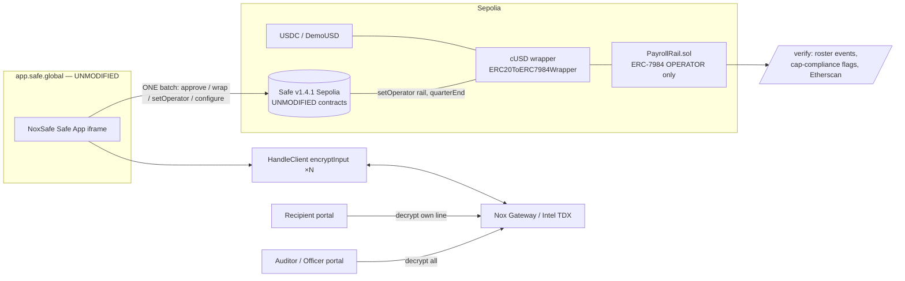

# NoxSafe — Architecture

## Stack
Solidity `^0.8.28` (solc 0.8.35, `viaIR`, optimizer 200) · Hardhat · `@iexec-nox/nox-protocol-contracts`
0.2.4 + `@iexec-nox/nox-confidential-contracts` 0.2.2 (ERC-7984 wrapper + `Nox` library) ·
`@iexec-nox/handle` 0.1.0-beta.13 (gateway SDK) · `@noxsafe/rail-sdk` (TS) + `@noxsafe/payroll-kit` (CLI) ·
Next.js Safe App + portals · `@safe-global/safe-apps-sdk` / `protocol-kit` / `api-kit` · ETH Sepolia.

## System diagram

## Contracts

- **`PayrollRail.sol`** — the only novel contract (~300 lines). Time-bound ERC-7984 operator; NOT a Safe
  module. Surface: `configure` (onlySafe) · `proposeRoster` (onlyTreasurer) · `approveRoster` (onlySafe) ·
  `executePayroll` (anyone) · `grantAuditor` / `grantOfficer` (onlySafe) · `proveSpendWithinBudget`. The
  encrypted budget invariant (`le`+`select`+`allowPublicDecryption`) and the operator-pull payout
  (`allowTransient` → `confidentialTransferFrom`) live here. See `SPEC.md` for invariants I1–I4.
- **`ConfidentialUSD.sol`** (cUSD) + **`DemoUSD.sol`** — the shared skeleton, **reused unmodified** from the
  sibling NoxSend build (`ERC20ToERC7984Wrapper` + a 6-decimal demo ERC-20). Already live on Sepolia; the
  funded run does NOT redeploy them.
- **Zero Safe-side code.** The rail never calls the Safe; the Safe only ever calls standard ERC-20/7984
  functions (`approve`, `wrap`, `setOperator`) + `rail.configure/approveRoster/grantAuditor`. Revocation =
  `cUSD.setOperator(rail, 0)` from the queue.

## Packages / apps

- **`@noxsafe/rail-sdk`** — framework-agnostic helpers (`amounts`, `handles`, `acl`, `roster`, `config`,
  `abis`) + `NoxSafeClient` (ethers). The `roster` module (CSV parse, the plaintext mirror of the on-chain
  `le`+`select` accumulator, the on-chain-matching `computeRosterHash`) is the single source of truth for
  the CLI, scripts, UI, and tests. 128 unit tests.
- **`@noxsafe/payroll-kit`** — headless CLI (`roster preview/propose/execute`, `audit`, `verify`,
  `grant-auditor/officer`, `prove-budget`). `roster preview` runs fully offline.
- **`web/`** — Next.js Safe App (onboarding batch builder + roster builder + status board) and standalone
  recipient / auditor portals + `/verify`, styled to the synthwave theme. Safe App manifest at
  `public/manifest.json`.

## Local testing model (why it's zero-mock in spirit, zero-gas in fact)

On-chain Nox operations (`add/le/select/…`) deterministically derive result handles, set ACL, and emit
events — the TEE computes plaintext off-chain. So the rail's **logic** is fully testable locally against a
faithful `MockNoxCompute` double (relocated to the canonical local address `0x75C6…` via `hardhat_setCode`).
The product contracts (PayrollRail, cUSD wrapper, DemoUSD) are byte-identical between local and Sepolia; the
double stands in only for the TEE protocol dependency, and is never deployed to Sepolia. Plaintext-value
correctness ("designer decrypts 4,200"; cap flags true×5+false×1) is asserted on Sepolia by `scripts/e2e.mjs`.

## Protocol invariants & residual risk
See `SPEC.md` (I1 bounded authority · I2 encrypted cap · I3 approval integrity · I4 ACL exactness) and
`feedback.md` (15 dated findings from building on Nox).
