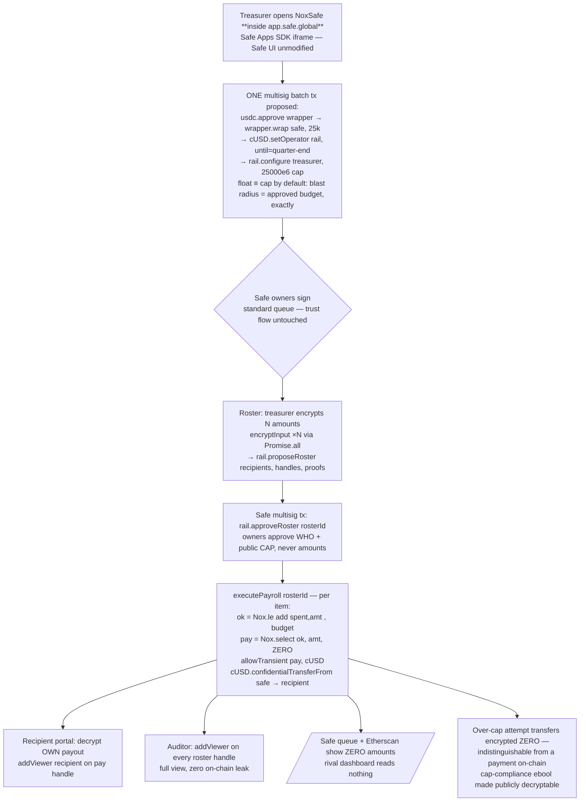

# Complexity Blueprint: NoxSafe

> `/squeeze-complexity` output. Source idea: `../../IDEAS.md` #1 (portfolio anchor). Every other doc builds on this. Clone-risk note: Safe-treasury is the 2nd-most-converged ideation cluster (~45/500) — this blueprint's differentiation is REAL Safe integration depth (in-UI Safe App + operator-not-module trust model + encrypted budget invariant), not the concept.

## 1. High-Complexity Data Pipeline

## 2. Cryptographic Schema (L1)

- **Amounts:** enter as `externalEuint256` + EIP-712 proof bound to the rail contract (`encryptInput(amt,'uint256',RAIL)`); `Nox.fromExternal` validates; `allowThis` persists; `addViewer(recipient)` at propose-time gives each contributor decrypt rights over exactly their line.
- **Encrypted budget invariant (the flagship trick):** cap is *public* (DAOs publish budgets), line items are *private*. `spent` is an encrypted accumulator; each payout computes `ok = Nox.le(Nox.add(spent, amt), toEuint256(cap))` then `pay = Nox.select(ok, amt, ZERO)` — enforcement happens **in encrypted space**; an over-cap line pays encrypted zero, on-chain indistinguishable from success. `Nox.allowPublicDecryption(ok)` lets anyone audit cap compliance without seeing amounts.
- **Roster integrity:** `rosterHash = keccak256(abi.encode(recipients, handles))` emitted at propose; owners approve the id+hash via multisig — what-was-approved is tamper-evident while amounts stay sealed.

## 3. Economic Engine (L2 — the trust model IS the feature)

- **Operator, not module:** the rail holds **no Safe execution rights** — it is a time-bound ERC-7984 operator (`setOperator(rail, uint48 quarterEnd)`), granted and revocable (`setOperator(rail, 0)`) by standard multisig tx. Blast radius if the rail is malicious: **the wrapped payroll float — which the app defaults to exactly the approved budget cap** (the operator grant technically covers the full wrapped balance, so float ≡ cap keeps the worst case identical to the approved spend; stated honestly). The Safe's unwrapped USDC is untouchable. This is the institutional pitch line.
- **Wrapper escrow:** Safe wraps only the payroll float (USDC→cUSD 1:1, **default float = budget cap**); unwrap of residue back to USDC via the 2-step decryption-proof path.
- **Role separation:** owners (approve cap+roster) / treasurer (proposes, sees plaintext amounts client-side) / recipients (decrypt own) / auditor (decrypt all, read-only) — four distinct ACL profiles demonstrated live.

## 4. Developer Toolkit (L3)

- **npm `@noxsafe/payroll-kit`:** `wrapFloat(safe, amount)` · `proposeRoster(items[]): rosterId` (concurrent encryption) · `approveRosterTx(rosterId): SafeTransaction` (protocol-kit builder) · `execute(rosterId)` · `decryptMyPayout()` · `grantAuditor(addr)`.
- **CLI:** `noxsafe roster propose --csv roster.csv` · `noxsafe roster execute <id>` · `noxsafe audit --as <viewer>` · `noxsafe bench`.
- **Formal mini-spec (`SPEC.md` in repo):** state machine `DRAFT → PROPOSED → APPROVED → EXECUTING → SETTLED`; invariants **I1** rail can never move > cap per roster epoch (select-enforced), **I2** rail has zero Safe execution authority, **I3** every payout handle has exactly {rail, recipient, (auditor)} access, **I4** approve/revoke always one multisig tx.

## 5. Verification & Benchmarks (L4)

- **`scripts/bench.ts`:** roster of N=10 → concurrent `encryptInput` wall-time, per-payout gas, execute-tx latency, recipient decrypt p50/p95 (feeds feedback.md).
- **Deterministic seed:** scripted demo Safe (protocol-kit: 2-of-3 owners from fixed mnemonic) + 5-contributor roster CSV; `seed.ts` replays the full quarter start-to-settled; before/after exhibit = a plain-ERC-20 CSV payout on the same Safe (amounts naked in queue) vs the NoxSafe roster.
- **`check_submission_readiness.ts`** same gate set as NoxSend.

## 6. Production Credibility (L5)

- Real Safe v1.4.1 on Sepolia created via **app.safe.global** (unmodified UI, real tx service); wrapper Etherscan-verified (reused), rail source-verifiable via `npm run verify:contracts`; Safe App manifest served from the Vercel deploy so judges can add it to their own Safe via "Add custom Safe App"; `/verify` page streams roster/payout events + cap-compliance handles.

## v2 Depth Amendments (capability audit 2026-07-11 — bounded, no new build days)

1. **Full ACL role matrix in ONE org chart** — add a **compliance-officer ADMIN role** distinct from the auditor: Safe grants `Nox.allow(lineHandle, officer)` (admin = can decrypt AND extend viewers without a new multisig round-trip — e.g., hand a regulator read access mid-audit), while the auditor stays `addViewer` (read-only). Product now demonstrates every role the protocol has: none (public) / transient (rail→token) / viewer (recipient, auditor) / admin (officer) / publicly-decryptable (cap-compliance flags). Honest note in UI + docs: **admin grants are irrevocable by design** — which is exactly why the officer role is a deliberate multisig decision.
2. **`safe*` arithmetic evaluation beat** — Day-5 unit tests compare `le`+`select` (shipped) against `safeSub` overflow-detection semantics for the budget invariant; whichever loses, the comparison is a dated feedback.md finding (the graded doc rewards exactly this).
3. **TEE attestation panel** on `/verify` — same as siblings: attestation portal + dstack quote service links + trust explainer; Nox Sepolia protocol contract `0x24ef36ec5b626d7dcd09a98f3083c2758f0f77bf` pinned (re-verify at build).
4. **Live `isViewer`/`isAllowed` checks** in the auditor/officer panels (not just `viewACL`) — the org chart is *provable on-chain* in front of the judge.
5. **Tooling feedback beats**: Contracts Wizard scaffold trial + Context7 MCP docs loading → one dated feedback.md finding each; cited in README.
6. **Payslip deep-links** — recipient portal URLs like `/payslip/<rosterId>/<index>` so each contributor gets a private permalink (zero contract work, big product feel in the video).

## v3 — Capability Maximization (tiered, 2026-07-11 — max-winnable pass)

> Same discipline as the sibling entries: **additive + gated**. Tier A ships in core; Tier B unlocks on core-green at the Jul-27 anchor gate; Tier C is honest roadmap. NoxSafe's v3 turns "confidential payroll" into a **confidential treasury OS** — the "real product a company could deploy" the brief is explicitly grading. New Nox surface vs v2: deeper `le`+`select` (vesting curves), aggregate `add` + `allowPublicDecryption` (audit proof), multi-wrapper; plus **Sablier** as protocol #2 and a **subgraph**.

### Tier A — ships in core (~1.5 days total)
1. **Confidential vesting / cliff schedules (deeper `le`+`select` over time).** The #1 missing real-payroll feature: equity/token grants with an encrypted total + public cliff/duration. Each claim releases `Nox.select(le(now, cliff), 0, vestedSlice)` where `vestedSlice = mul(total, elapsed) / duration` (encrypted × public scalar — shares NoxOracle's Day-9 `mul/div` spike; `le`-gated linear fallback if scalar mul is unstable). Amounts stay sealed; the *schedule* is public. ~1 day. Makes NoxSafe cover contributors **and** founders/advisors.
2. **Cryptographic accounting proof (aggregate `add` + `le` + `allowPublicDecryption`).** The CFO/DAO proves **"total spend this quarter ≤ approved budget"** by `allowPublicDecryption(Nox.le(Nox.add(all roster sums), quarterCap))` — a single public ebool audited by anyone, revealing **no line and not even the total**. Confidential accounting is the institutional headline. ~0.5 day.
3. **Multi-token payroll.** cUSD + cUSDC + cEUR via parallel `ERC20ToERC7984Wrapper`s in one Safe batch; roster rows carry a token id. Deepens wrapper usage; matches how real treasuries actually pay. ~0.5 day. *Fallback:* single-token (core).

### Tier B — depth extensions (gated on core-green at Jul-27)
4. **Sablier stream privacy (real protocol #2).** For continuous contributors, route a Sablier V2 Lockup through the PayrollRail: the rail wraps each streamed withdrawal into cUSD so the **stream rate/amount is confidential** end-to-end — the brief's exact "private streams" ask, layered on **unmodified** Sablier. ~1.5 days. *Build-time:* verify Sablier V2 Sepolia; *fallback:* discrete monthly roster already models recurring pay.
5. **Encrypted per-role spend limits.** Extend the compliance-officer/auditor org chart with **encrypted role caps** (junior ≤ X, senior ≤ Y) enforced with `le`+`select` at execute — role-based confidential budgeting.

### Tier C — roadmap (README: "designed, not shipped")
6. **Optional Safe Module path** — a documented alternative to the operator model for teams wanting deeper automation (auto-execute on schedule). Shipped as a *design note + trust-trade-off table*, NOT built — preserves the operator-not-module thesis while proving we understood the fuller design space (feedback-grade insight).
7. **Cross-Safe / multi-org confidential payroll** (one rail, many Safes) — roadmap.

### Dev-tools elevation (L3 → real product)
- **`@noxsafe/rail-sdk`** (TS, MIT) + **`@noxsafe/react`** hooks (`useRoster` · `useVesting` · `useComplianceProof` · `useDecryptPayout`) + the published **Safe App manifest** (add-to-your-Safe) + **The Graph subgraph** indexing the roster lifecycle (DRAFT→SETTLED) so the before/after exhibit and `/verify` run off the subgraph, not RPC polling. *Fallback:* `watchContractEvent`.
- **Test target 70 → 110:** + vesting truth-table (pre-cliff→0, mid→linear, post→full), + accounting-proof (over-budget flips the public ebool), + multi-token routing, + role-cap enforcement, + Sablier-adapter wrap parity.

### v3 build-time verifications (append to AUDIT §BUILD-TIME)
- Encrypted × public scalar `mul/div` for the linear vesting slice (shared with NoxOracle Spike A; `le`-stepped fallback). · Sablier V2 Lockup on Sepolia (Tier B4). · Subgraph for Sepolia or local graph-node. All fallbacks keep the zero-mock quarter-lifecycle demo intact.

## Integration Checklist
- [x] Crypto: TDX handles + select-enforced encrypted invariant + public-decryption audit hook + attestation panel
- [x] Economic: time-bound operator delegation + budget cap + wrapper escrow
- [x] Packaged: payroll-kit npm + CLI + SPEC.md invariants
- [x] Bench: reproducible p50/p95 + per-payout gas
- [x] Production: real Safe + verified contracts + persistent hosted Safe App
- [x] Full ACL role matrix (viewer/admin/transient/public) as the org chart, live-inspectable
- [x] v3 confidential vesting/cliff schedules (`le`+`select` over time; encrypted amounts, public schedule)
- [x] v3 cryptographic accounting proof (aggregate `add` + `le` + `allowPublicDecryption` = "spend ≤ budget", no lines leaked)
- [x] v3 multi-token payroll (parallel wrappers) + encrypted per-role spend caps
- [x] v3 second protocol: Sablier V2 stream privacy (unmodified) — confidential streams
- [x] v3 dev-tools product: `@noxsafe/rail-sdk` + `@noxsafe/react` + published Safe App manifest + subgraph
- [x] v3 test target 70 → 110 (vesting truth-table · accounting-proof · multi-token · role caps · Sablier parity)
